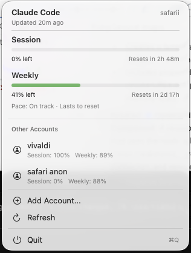

# Claude Multi-Account Switcher

A native macOS menu bar application designed to help power users manage multiple Claude (Anthropic) accounts and monitor usage limits in real-time.

**Note:** This project is inspired by [CodexBar](https://github.com/joshua-wong/codexbar) and aims to provide similar robust usage tracking with multi-account switching capabilities.

## Features

*   **Multi-Account Support**: seamless switching between different Claude accounts.
*   **Real-time Usage Tracking**: Monitor both **Session** and **Weekly** rate limits directly from the menu bar.
*   **Smart Icon**: The menu bar icon dynamically updates to show session (top bar) and weekly (bottom bar) remaining capacity.
*   **Native & Lightweight**: Built with SwiftUI and AppKit for a native macOS experience.
*   **Secure**: Stores OAuth credentials securely in the macOS Keychain.
*   **Notifications**: Get notified when your rate limits reset or when you hit a limit.
*   **Auto-Fetching**: Automatically fetches the latest usage data using Claude's OAuth API.

## Installation

1.  Clone this repository.
2.  Open `ClaudeAccountSwitcher.xcodeproj` in Xcode.
3.  Ensure you have a valid signing team selected in the project settings.
4.  Build and Run (Cmd+R).
5.  Move the built application to your `/Applications` folder if desired.

## Building for Release (GitHub)

To create a shareable `.app` for GitHub Releases:

1.  Open the project in Xcode.
2.  Select **Product** > **Archive** from the menu bar.
3.  Once the archive finishes, the **Organizer** window will appear.
4.  Select the latest archive and click **Distribute App**.
5.  Choose **Custom** > **Copy App**.
6.  Save the `ClaudeAccountSwitcher.app` to your Desktop.
7.  Right-click the app and choose **Compress** to create a `.zip` file.
8.  Upload this zip file to your GitHub Release.

## Usage

1.  **Adding an Account**:
    *   Click the menu bar icon.
    *   Select **Add Account...**.
    *   Enter a name for the account.
    *   A terminal window (or browser flow) will open to authenticate with Anthropic.
    *   Once logged in, the app will automatically detect the new credentials and fetch your usage data.

2.  **Switching Accounts**:
    *   Simply click on any account in the list to switch to it.
    *   The active account is highlighted with a blue indicator.

3.  **Removing Accounts**:
    *   Right-click on an inactive account in the list.
    *   Select **Remove** and confirm.

## Technical Details

*   **Authentication**: The app looks for credentials in `~/.claude/credentials.json` and the macOS Keychain (service: `Claude Code-credentials`).
*   **API**: Uses Anthropic's OAuth usage endpoint (`https://api.anthropic.com/api/oauth/usage`) to fetch precise rate limit data.
*   **Compatibility**: Designed to work alongside the `claude` CLI tool.

## Requirements

*   macOS 13.0 (Ventura) or later.
*   Xcode 15+ for building.

## License

MIT License. See [LICENSE](LICENSE) file for details.
